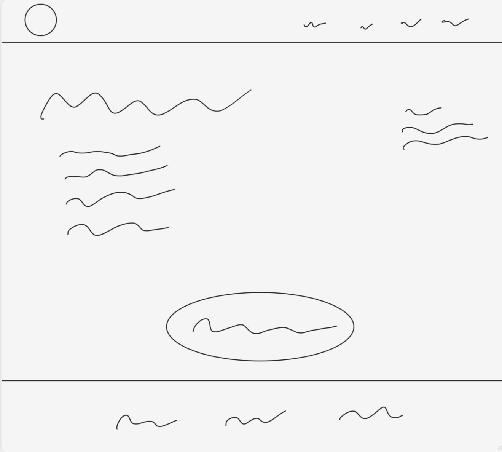

# C2 : Interface com o Utilizador

Aqui iremos mostar um bocado de como foi idealizado o site, e como foi desenhado para depois ser posto na prática. A organização do site baseou-se em ter quatro páginas estáticas onde a navegação entre elas é feita através dos menus que se encontram no canto superior esquerdo. 

## Planeamento 

Nos tópicos seguintes vão ser mostradas imagens, onde se pode observar os esboços realizados para o planeamento do site e de cada página.

### Sketchs

_Página 1 e 2_

| | |
:---: | :---:
                              | 
Página inicial com fotos da associação, menus, e uma descrição. |  Página com fotos e descrição dos animais da associação.

_Página 3 e 4_

| | |
:---: | :---:
                               | 
Página com a descrição da associação.                     | Página com lista de produtos para doação e botão para o Paypal

### Sitemap

Aqui poderemos ver um sitemap do nosso projeto.

  
Nesta imagem podemos ver os menus que apresentamos no nosso projeto.

---
[< Anterior](c1.md) | [^ Principal](../../../) | [Próximo >](c3.md)
:--- | :---: | ---: 
