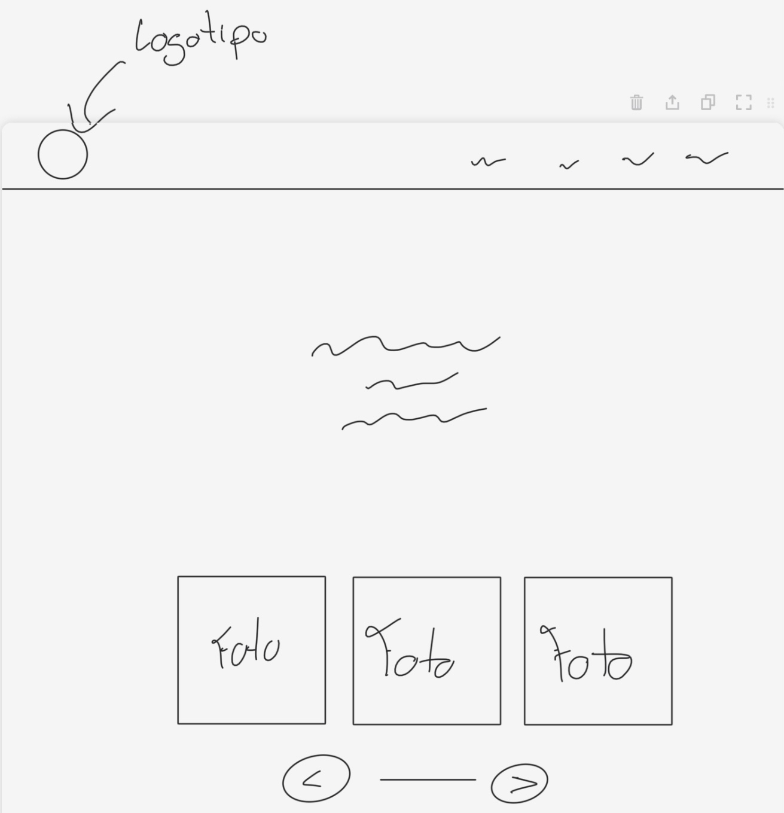
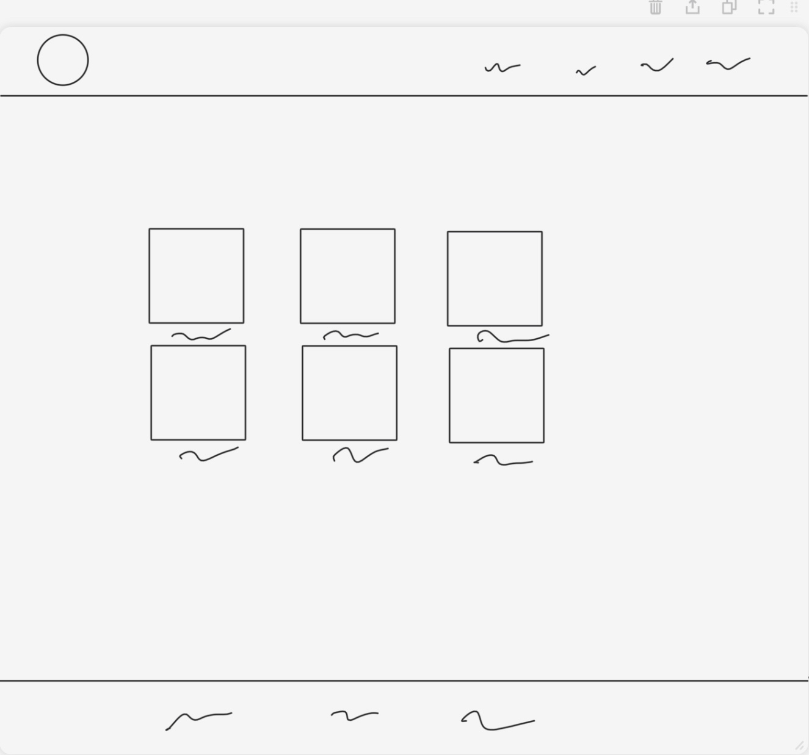
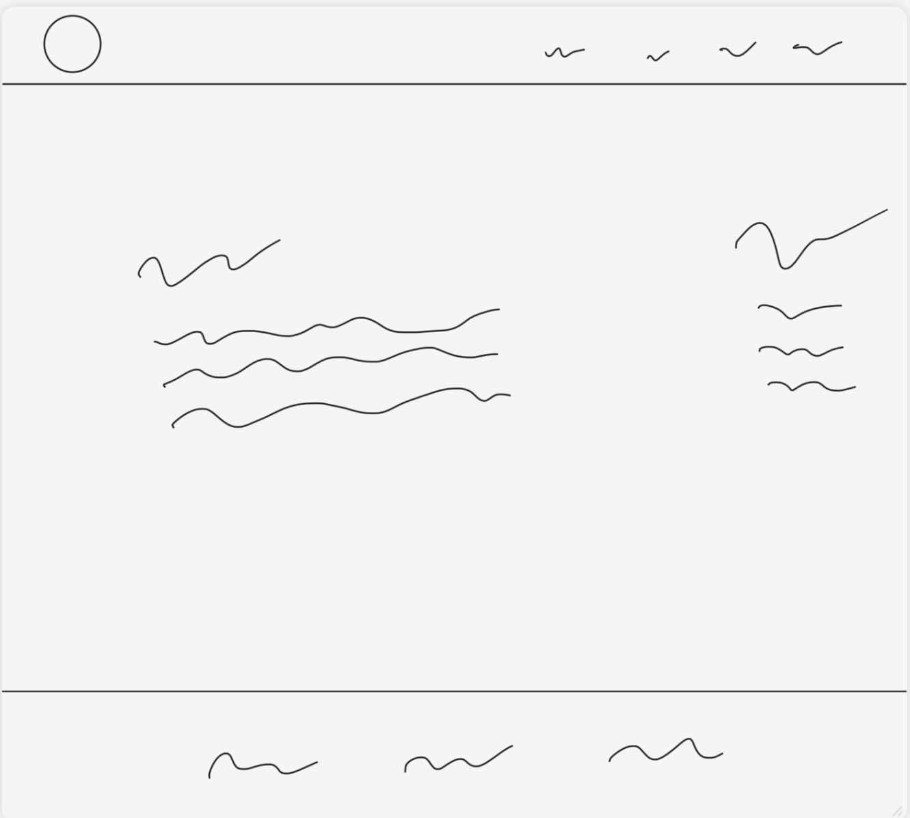
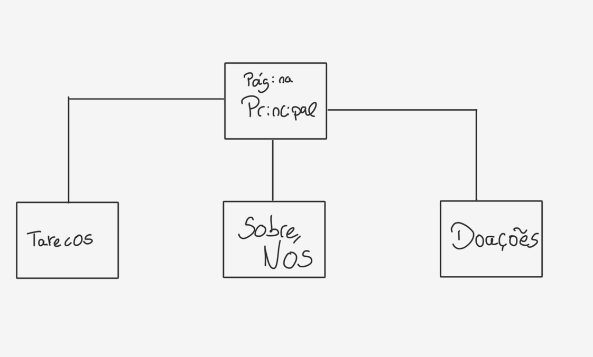

# C2 : Interface do Utilizador

Aqui iremos mostar um bocado de como foi idealizado o site, e como foi desenhado para depois ser feito na prática.
## Interface and Common features
_Add here your creative process results using sketchs or wireframes (or even both)_

### Sketchs

_Página Inicial_

| | |
:---: | :---:
 | 
Nesta imagem podemos ver um esboço da página inicial |  Nesta imagem podemos ver a página onde serão exibidos os animais para adoção

### Wireframes

__  

| |
:---:
 |
Nesta imagem podemos ver o esboço do sobre n |

### Sitemap

Aqui poderemos ver um sitemap do nosso projeto.

  
Nesta imagem podemos ver os menus que apresentamos no nosso projeto.

---
[< Anterior](c1.md) | [^ Principal](../../../) | [Próximo >](c3.md)
:--- | :---: | ---: 
