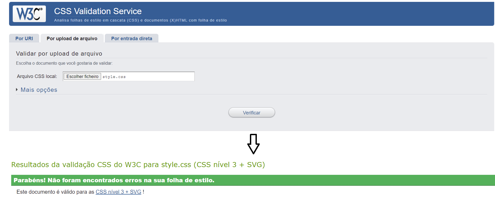
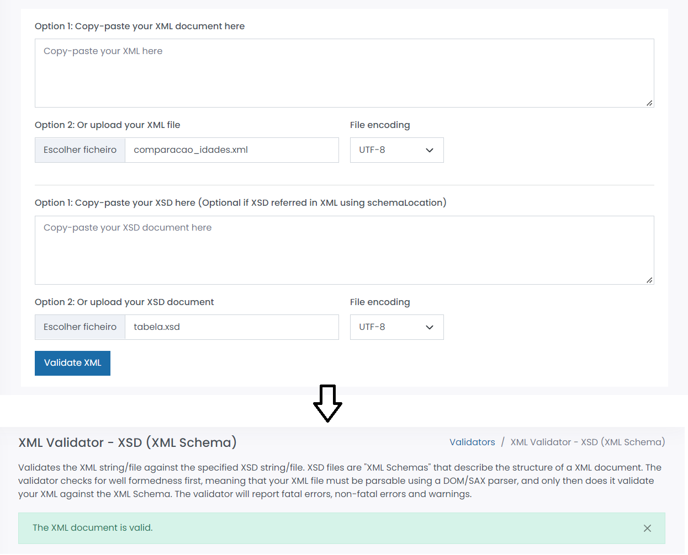
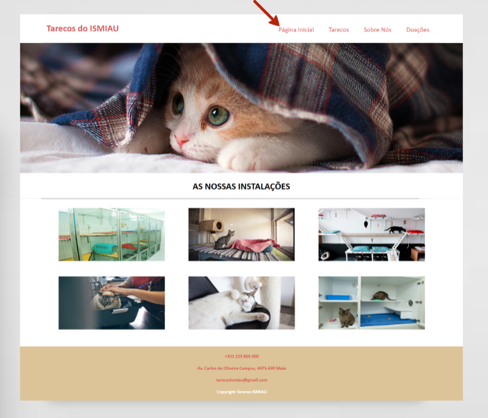
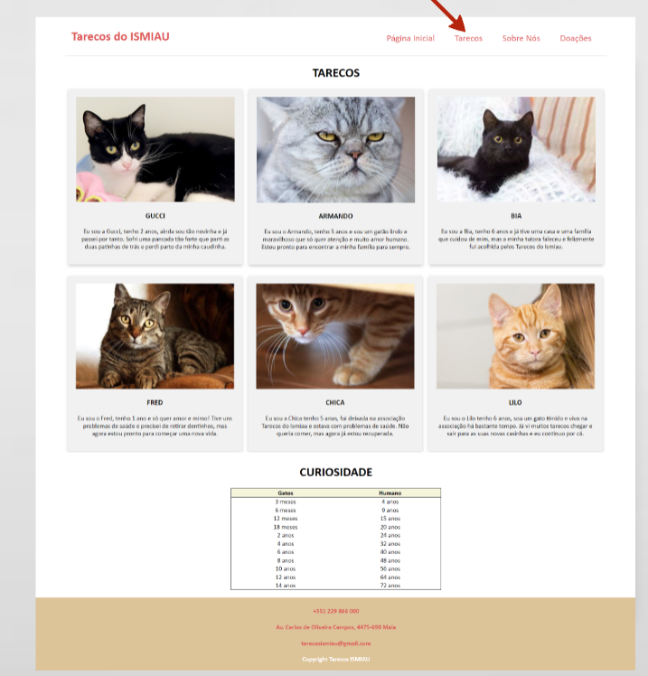
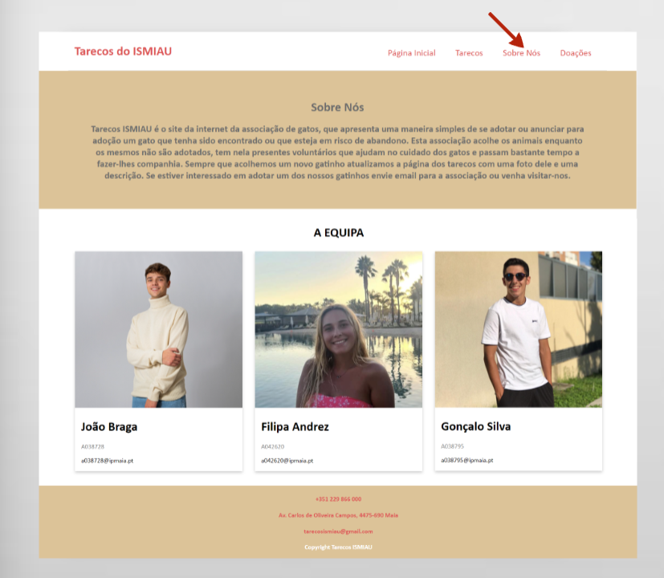
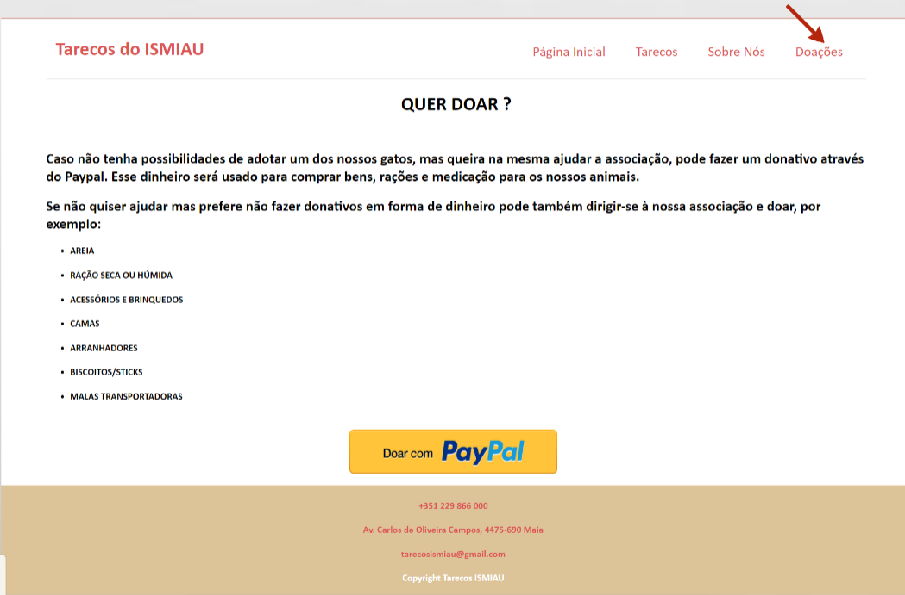

# C3 : Produto

Os Tarecos do Ismiau foi um projeto desenolvido por este grupo, que consiste num sitio Web, com quatro páginas estáticas sobre uma associação/centro de adoção de gatos, na navegação pelo site passa-se desde páginas com imagens dos animais da associação até a páginas com local próprio para recolha de fundos.

## 3.1 Objetivos
O objetivo inicial do grupo para este trabalho era a criação de quatro páginas estáticas sobre a associação, onde existiria uma página "home" com imagens e uma pequena descrição da associação, outra com iamgens dos gatos acolhidos pelo assciação e uma pequena desccrição dos mesmos, outra página com uma descrição mais detalhada da associação e por fim uma com um local para fazer doações.
O grupo pode dizer que, após a realização do trabalho cumpriu, em grande parte com o planeado inicialmente para a construção das páginas web, incluindo a organização e as ideias presentes nas mesmas. Algumas alterações ocorreram durante a realização do trabalho, uma vez que iamos tendo ideias que se adequavam melhor e acrescentamos essas ideias a algumas das páginas, colocando-as pela nossa visão, melhores. 
No produto final, a "Página Principal" tem apenas fotografias da associação e optamos por colocar a descrição da associação apenas na página "sobre nós" onde também colocamos uma fotografia de cada elemento do grupo. Tal como foi planeado temos a página "Tarecos" onde foram colocadas fotos dos gatos da associação, mais uma descrição sobre os mesmos, e decidimos adicionar uma tabela com curiosidades sobre a idade dos gatos, onde existe a comparação com a idade dos humanos. A última página criada, foi a página "Doações", onde é apresentada uma lista de artigos para doar na associação e um botão para o Paypal. No final de cada página colocamos links e informações sobre o email, número de telemóvel e morada da associação.

## 3.2 Uso
Para vizualizar as alterações que iam sendo realizadas no site, o grupo fez o download do Xampp. 

(Falta adicionar a ligação para o Netlify)

## 3.3 Utilização pelo usuário
A navegação pelo sítio Web criado é bastante simples para o usuário. Essa faz-se através de menus, que se localização na parte superior do site. Cada menu tem uma tooltip para ajudar o utilizador a navegar pelas páginas. Na parte inferior de todas as páginas exitem também tooltips presentes no email, no número de telemóvel e na morada.

## 3.4 Formulário

_If any, how are you validating user input on the forms?_
_Describe with examples._

## 3.5 Validação HTML5, CSS3, XML e XMLSchema

Para a validação do HTML5 e do CSS3 do nosso trabalho o grupo utilizou o validator.w3, onde é possível colocar o código ou o ficheiro, por exemplo do HTML no "HTML Checker" e verificar se o código apresenta erros ou não. Para validar o XML e O XMLSchema foi utilizado o freeformater.com. Foram utilizadas prints para mostrar a validação que foi realizada nos documentos do trabalho. 
Para o documento de CSS, não foram apresentados erros, como se pode provar na composição da imagem seguinte. 
Para os documentos de HTML, 
Para os documentos de XML e XMLSchema, não foram encontrados erros, tal como mostra na imagem. 

## 3.6 Projeto Final

| | |
:---: | :---:
                              | 
Página inicial com fotos da associação, menus, e uma descrição.      |  Página com fotos e descrição dos animais da associação, e curiosidades.

| | |
:---: | :---:
                               | 
Página com a descrição da associação e foto dos membros.       | Página com lista de produtos para doação e botão para o Paypal.

---
[< Anterior](c2.md) | [^ Principal](../../../) | [Próximo >](c4.md)
:--- | :---: | ---: 