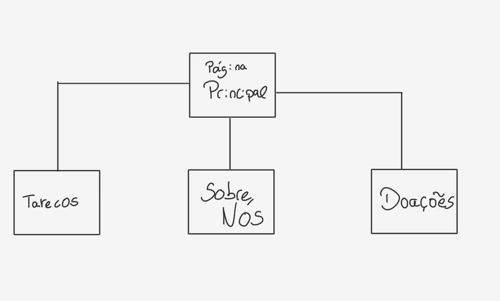
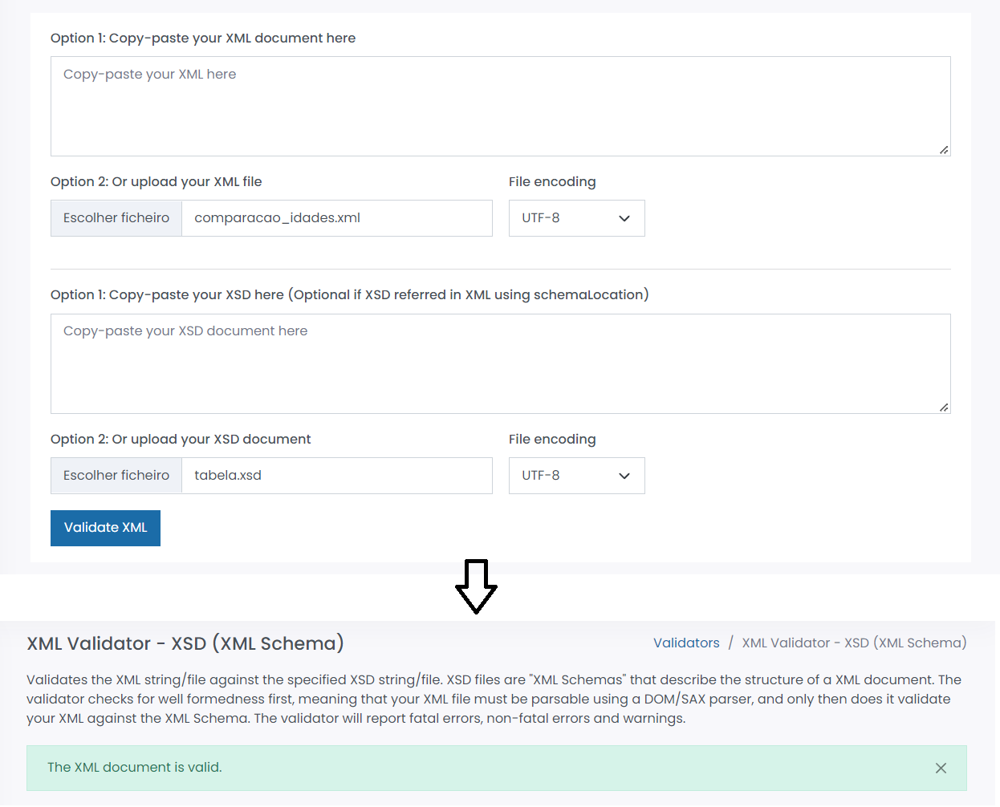
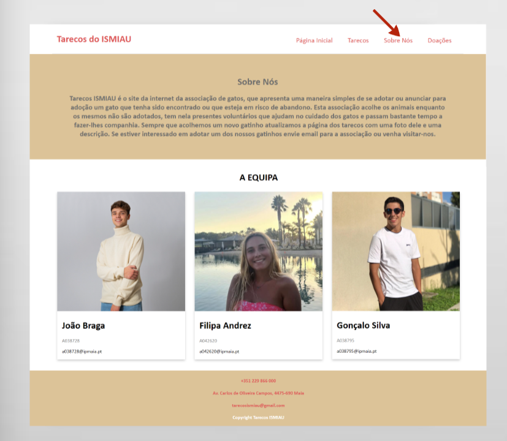
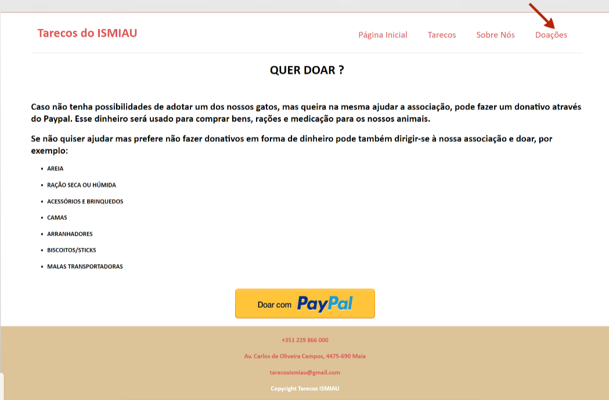

# C1 : Apresentação do Projeto - Tarecos do Ismiau

## Descrição

No âmbito da disciplina de Tecnologias da Internet, do primeiro ano da licenciatura em Tecnologias de Informação, Web e Multimédia, foi-nos proposta a realização de um trabalho prático onde a área temática definida pelo docente foi “Animais”. O trabalho consiste no desenvolvimento de um conjunto de quatro páginas estáticas, criando um sitio Web com recurso a HTML 5, CSS 3, JavaScript e XML.
Iremos então desenvolver um pouco sobre o tema que escolhemos dentro da área temática “Animais”. O tema escolhido pelo grupo foi “Associação de animais/Centro de adoção”, mais especificamente sobre uma associação de gatos abandonados. A escolha teve como base a preocupação pelo bem-estar animal, nomeadamente animais abandonados e sem dono, que atualmente é uma realidade que se tem vindo cada vez mais a discutir. O abandono de animais sempre existiu, mas nos dias de hoje existe também uma maior consciencialização relativamente a este tema, o que tem levado ao aparecimento de muitas associações, que têm como objetivo cuidar deles e arranjar uma nova família para os acolher. 
Na criação das páginas do sítio Web, vamo-nos focar em várias áreas, são elas a divulgação da associação, nomeadamente a apresentação da mesma, descrevendo qual a sua função e objetivo. Relativamente aos animais, iremos colocar fotografias dos gatos para incentivar a adoção e o apadrinhamento dos mesmos resgatados pela associação. E por fim, e não menos importante para quem não tem possibilidade nem condições de adotar damos a possibilidade de contribuir através da recolha de fundos que se destinarão à alimentação, medicação e vacinação dos animais da associação. 

## Grupo 03

* Gonçalo Machado Silva [@GoncaloSilva38795](https://github.com/GoncaloSilva38795)
* Filipa Brandão Soares Alexandre Andrez [@Filipaandrez](https://github.com/Filipaandrez)
* João Braga Lopes [@joaobraga27](https://github.com/joaobraga27)

# C2 : Interface com o Utilizador

Aqui iremos mostar um bocado de como foi idealizado o site, e como foi desenhado para depois ser posto na prática. A organização do site baseou-se em ter quatro páginas estáticas onde a navegação entre elas é feita através dos menus que se encontram no canto superior esquerdo. 

## Planeamento 

Nos tópicos seguintes vão ser mostradas imagens, onde se pode observar os esboços realizados para o planeamento do site e de cada página.

### Sketchs

_Página 1 e 2_

| | |
:---: | :---:
                              | 
Página inicial com fotos da associação, menus, e uma descrição. |  Página com fotos e descrição dos animais da associação.

_Página 3 e 4_

| | |
:---: | :---:
                               | 
Página com a descrição da associação.                     | Página com lista de produtos para doação e botão para o Paypal

### Sitemap

Aqui poderemos ver um sitemap do nosso projeto.

  
Nesta imagem podemos ver os menus que apresentamos no nosso projeto.
# C3 : Produto

Os Tarecos do Ismiau foi um projeto desenolvido por este grupo, que consiste num sitio Web, com quatro páginas estáticas sobre uma associação/centro de adoção de gatos, na navegação pelo site passa-se desde páginas com imagens dos animais da associação até a páginas com local próprio para recolha de fundos.

## 3.1 Objetivos
O objetivo inicial do grupo para este trabalho era a criação de quatro páginas estáticas sobre a associação, onde existiria uma página "home" com imagens e uma pequena descrição da associação, outra com iamgens dos gatos acolhidos pelo assciação e uma pequena desccrição dos mesmos, outra página com uma descrição mais detalhada da associação e por fim uma com um local para fazer doações.
O grupo pode dizer que, após a realização do trabalho cumpriu, em grande parte com o planeado inicialmente para a construção das páginas web, incluindo a organização e as ideias presentes nas mesmas. Algumas alterações ocorreram durante a realização do trabalho, uma vez que iamos tendo ideias que se adequavam melhor e acrescentamos essas ideias a algumas das páginas, colocando-as pela nossa visão, melhores. 
No produto final, a "Página Principal" tem apenas fotografias da associação e optamos por colocar a descrição da associação apenas na página "sobre nós" onde também colocamos uma fotografia de cada elemento do grupo. Tal como foi planeado temos a página "Tarecos" onde foram colocadas fotos dos gatos da associação, mais uma descrição sobre os mesmos, e decidimos adicionar uma tabela com curiosidades sobre a idade dos gatos, onde existe a comparação com a idade dos humanos. A última página criada, foi a página "Doações", onde é apresentada uma lista de artigos para doar na associação e um botão para o Paypal. No final de cada página colocamos links e informações sobre o email, número de telemóvel e depois a indicação da morada da associação.

## 3.2 Uso
Para vizualizar as alterações que iam sendo realizadas no site, o grupo fez o download do Xampp. 
Após tudo concluido colocamos o site no Netlify [Acesso ao site](https://fluffy-crostata-c5751f.netlify.app/tecnologias/index.html)

## 3.3 Utilização pelo usuário
A navegação pelo sítio Web criado é bastante simples para o usuário. Essa faz-se através de menus, que se localização na parte superior do site. Cada menu tem uma tooltip para ajudar o utilizador a navegar pelas páginas. Na parte inferior de todas as páginas exitem também tooltips presentes no email, no número de telemóvel.

## 3.4 Validação HTML5, CSS3, XML e XMLSchema

Para a validação do HTML5 e do CSS3 do nosso trabalho o grupo utilizou o validator.w3, onde é possível colocar o código ou o ficheiro, por exemplo do HTML no "HTML Checker" e verificar se o código apresenta erros ou não. Para validar o XML e O XMLSchema foi utilizado o freeformater.com. Foram utilizadas prints para mostrar a validação que foi realizada nos documentos do trabalho. 
Para o documento de CSS, não foram apresentados erros, como se pode provar na composição da imagem seguinte. 
Para os documentos de HTML, não encontrados erros, como se pode verificar nas iamgens seguintes.    
Para os documentos de XML e XMLSchema, não foram encontrados erros, tal como mostra na imagem. 

## 3.5 Projeto Final

| | |
:---: | :---:
                              | 
Página inicial com fotos da associação, menus, e uma descrição.      |  Página com fotos e descrição dos animais da associação, e curiosidades.

| | |
:---: | :---:
                               | 
Página com a descrição da associação e foto dos membros.       | Página com lista de produtos para doação e botão para o Paypal.

# C4 : Apresentação

Para a apresentar o trabalho o grupo realizou uma apresentação com recurso ao Prezi. 

* [Prezi](https://prezi.com/p/edit/lw086lju9iul/);
